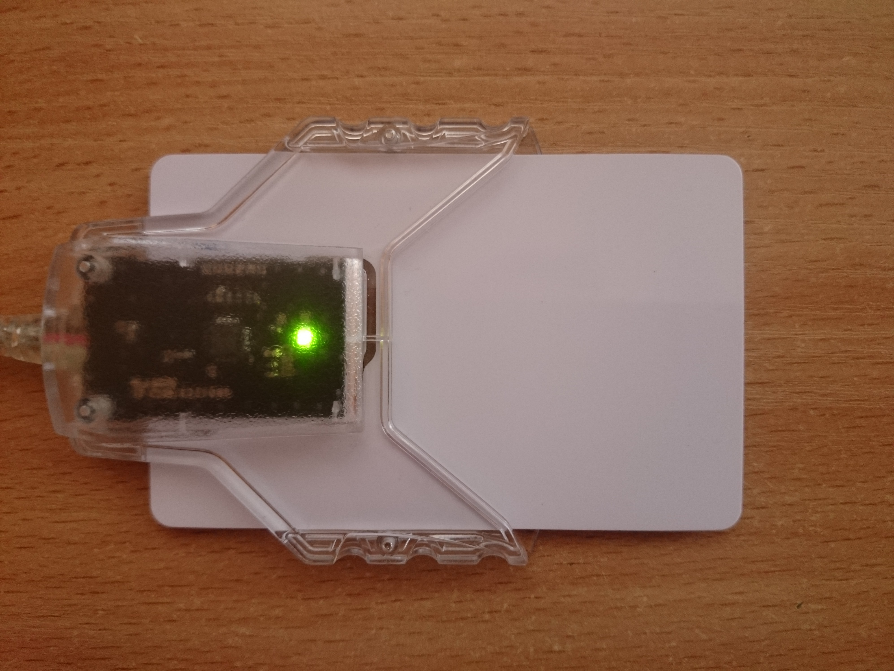
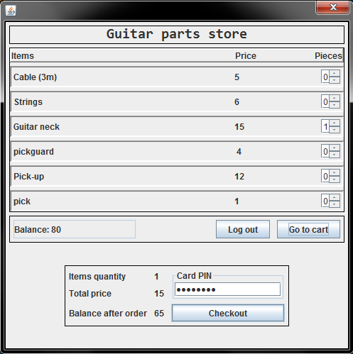

# Loyalty - GUI

Guitar store application GUI build to communicate with preinstalled [loyalty-applet](https://github.com/gecko031/loyalty-applet) on smart card. 
It uses two user accounts. User and administrator. User can buy stuff from application and administrator  can manipulate poins on the very same card.
 
 
 
Smart Card with Gemalto IDBridge
 
 
 
LoyaltyGUI user Layout

## Getting Started

To run Guitar store application you need to download jar file from `release` tab or clone repository 
and open with Intellij or any favourite IDE. To install applet dedicated to this applciation 
go to smart card applet description [README](https://github.com/gecko031/loyalty-applet).

### Prerequisites

* Smart card (Java Card OS) - (I used one of the cheapest, model J2A040 from aliexpress.com - [link here](https://www.aliexpress.com/i/32856082491.html))
* Download GPShell
* Buy PC/SC card reader (Must support T=0 protocol) - (I used Gemalto IDBridge CT30)
* Download and Install Gem PcCCID driver for card reader

## Running the tests

1.	Plug the card with [applet](https://github.com/gecko031/loyalty-applet) inside reader.
2.	Log into either `user` account (password: 123) or `admin`(password: 1234) account.
3.	Go shopping or manipulate card points depending on which account type you are logged in.

## Built With

* Java Swing
* Library [javax.smartcardio](https://docs.oracle.com/javase/7/docs/jre/api/security/smartcardio/spec/)

## License

This project is licensed under the MIT License
